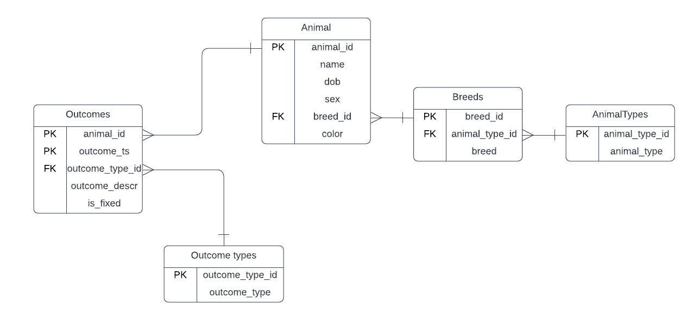

The only possible violation of 3NF in the [original data](https://data.austintexas.gov/Health-and-Community-Services/Austin-Animal-Center-Outcomes/9t4d-g238) is the relationship between  *animal, animal type, and breed*. 

There's a transitive dependency: animal type depends on the animal, and breed depends on animal type (e.g. "Domestic shorthair" can only be a breed of a cat, and "German shepherd" - only a breed of a dog).

One way to resolve this is to separate out the relationship between breed and animal type into a new table, and have a foreign key from the animal table to the breed table. 

In this example, I also chose to separate out some other data, namely outcome types and animal types.  Although not required by 3NF specificlaly, this helps with data integrity and is often convenient when e.g. coding up forms and dropdowns. It also makes things easier if an outcome type or animal type is renamed, or a new one is added.

I chose to use a natural composite key for the `outcomes` table, consisting of `animal_id` and `outcome_ts`, the idea being that even if a single animal has multiple outcomes, they cannot happen at the same time, so id + timestamp identifies the outcome completely

